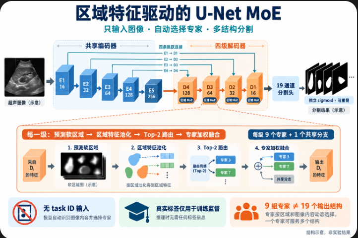

# 器官区域特征驱动的 U-Net MoE

> v6 九数据集划分、腹部 5 折跨来源验证与调参对照见 [EXPERIMENT_V6_PROTOCOL.md](../EXPERIMENT_V6_PROTOCOL.md)。该协议代码已就绪，但尚无新训练结果；下文 v5/旧版实验说明保留。

> 新的论文范围对齐协议（2026-09-29）通过 `--abdomen-labels paper5 --abdomen-split ct7_2` 显式启用：腹部只用肝、肾、血管、胆囊、脾，共 16 个分割输出、9 个专家；原 19 类/8 腹部类实验和 checkpoint 保留。原测试 CT 不动，原训练包按 7 个 CT 训练、2 个 CT 验证。可加 `--abdomen-positive-sampling 0.5` 仅在训练中按 CT 均衡并提高稀有前景图抽样。下文 19 类结构与旧运行说明均指历史协议。红色“血管”不等于精确主动脉标注，黄色“肾”不含论文的肾盂/皮质细分。

## 普通 U-Net 对比实验（2026-09-28）

`baseline_suite.py` 在同一份固定记录上比较一个共享 U-Net 与 9 个按数据集独立训练的 U-Net。共享模型输出 19 个结构；独立模型依次输出本数据集的 1/2/3/8 个结构。两者均只输入灰度图，五级编码器、四级解码器、默认 base=16；均按图像先平均有效标注通道的 BCE+Dice，再按 batch 平均。每轮从各数据集有放回抽取 500 张，同一轮同一数据集在两组中使用相同的抽样序列；输入大小 256×256，batch=2，seed=42，50 轮。验证集按有前景样本 Dice 选各模型最佳权重，固定阈值 0.5，测试集随后评估。

本次记录 SHA-256 为 `40848581290ba2e6bc4a6ee42da5bf4438b89c295f73917672fdcd9f53ed7df0`，包含 HC18 实心 mask；FALLMUD 只用 aponeurosis，AUL 只用 liver/mass，AbdomenUS 只用 AUS 模拟超声。`runs/unet_baseline_9v1/records.json` 保存完整记录，`protocol.json` 保存配置与各来源图像数，运行日志在 `runs/unet_baseline_9v1-logs/`。`comparison.json` 仅在全部训练完成时生成。若中断，使用相同命令加 `--resume` 从最后一轮继续。输出已启动，未完成前不能报告最终优劣。

```powershell
python -m unet_moe.baseline_suite --data-root "数据集 (Datasets)/pointed_data" --output runs/unet_baseline_9v1 --mode all --epochs 50 --size 256 --base 16 --batch-size 2 --quota 500 --workers 2 --seed 42 --device cuda
```

共享模型约 197 万参数；9 个独立模型合计约 1769 万参数。后者推理需要知道图像属于哪个数据集。两者参数总量不同，结果需连同参数与使用场景一起解读。旧 `region_top1_v1` 使用 HC18 轮廓标签及另一套损失和采样协议，不是这次比较的直接对照。

腹部零分结构的检查图在 `runs/region_top1_v1/abdomen_diagnostics/`：测试集各一张典型面积样本的原图、真值/预测叠加、预测概率。血管、肾上腺和骨均预测为空，最大前景概率约 `1.5e-5`、`8.9e-7`、`9.7e-6`。这仅是三张诊断样例，不代表全测试集的概率分布。

新版本只输入灰度图像，不输入 task ID、数据集 ID 或真实 mask。真实标签仅用于训练损失。旧模型、旧运行目录保持不变；新旧 checkpoint 不兼容。

## 结构

共享五级编码器（默认通道 16/32/64/128/256）→ 四级解码器 → 19 通道独立 sigmoid 分割输出。

每级解码器执行：

1. 上采样、拼接 skip、卷积融合，得到特征 F。
2. 预测 19 个软区域 M；按区域加权池化得到 `z_r = sum(M_r * F) / sum(M_r)`。
3. 同一个路由 MLP 根据各区域的视觉特征 z_r，分别选择 9 个专家中的 Top-2。不拼接类别编号或类别嵌入。
4. 将选中专家输出按区域概率和路由权重进行空间融合，并加上共享卷积分支。

每个解码阶段有独立的 9 个可路由专家及一个共享分支，并非全网络只有 9 个卷积模块。区域预测发生在专家计算之前，因此推理不需要真实区域。初始区域可能不准确，由粗分割监督和最终分割监督共同学习。


## 专家与输出

| 专家组           | 对应结构                                                       |
| ---------------- | -------------------------------------------------------------- |
| 乳腺 BUSI        | breast_lesion                                                  |
| 卵巢 MMOTU       | ovarian_lesion                                                 |
| 甲状腺 DDTI      | thyroid_nodule                                                 |
| 肝脏 AUL         | liver、liver_mass                                              |
| 下肢肌肉 FALLMUD | aponeurosis                                                    |
| 胎儿头部 HC18    | head_contour                                                   |
| 颈动脉 CCA       | carotid                                                        |
| 心脏 CAMUS       | lv_cavity、myocardium、left_atrium                             |
| 腹部 AbdomenUS   | 肝、肾、胰腺、血管、肾上腺、胆囊、骨、脾，名称带 abdomen_ 前缀 |

9 是专家组数，19 是分割输出数，两者不同。腹部 8 个输出的路由监督均指向腹部专家。FALLMUD fascicle 和 AUL ultrasound_outline 不进入新版本训练、验证及测试；原文件不删除。AUL 与 AbdomenUS 的肝脏输出暂时独立，保留不同标注来源的语义。

训练使用 `最终分割损失 + 0.3 × 各级粗分割损失均值 + 0.1 × 路由分类损失均值`。分割损失是忽略缺失标签的 BCE + Dice。路由分类只监督真实标注中存在前景的结构，指导对应专家分工；它不强制推理选中该专家，也不保证学到预期分工。

## 数据与评估

复用 `data.py` 的来源感知划分，按原图合并同图的多个标签。缺失通道标记 -1，不当作背景；AbdomenUS 的 ignore 像素继续屏蔽。AUL 使用独立 liver/mass 标注，保留重叠和缺失信息。按数据集的图像数反比采样，平衡九个来源。

当前 seed=42 的图像数量：训练 6244、验证 1500、测试 1618。验证集各结构的**有前景样本平均 Dice 的宏平均**用于选 best；训练结束后才用 best 评估测试集。同时保存包括空标签样本的 Dice。未知标签不能用于评估跨域误检，当前评估只覆盖已有标注。

## 运行

### 当前 Top-1 实验（2026-09-16）

已停止旧 task-ID 训练 `moe_full_9datasets_v3`（第 41 轮运行中；此前 checkpoint 和日志保留），新版本从头训练至 50 epochs：9 组专家、每区域 Top-1、size=256、base=16、batch=2、workers=2、seed=42、CUDA。输出目录 `runs/region_top1_v1`，日志 `runs/region_top1_v1-logs/stdout.log` 和 `stderr.log`。这不是仅改变 Top-k 的旧模型消融实验：架构、输出目标及配置也已改变。完整结果以训练完成后的测试指标为准。

```powershell
python -m unet_moe.region_train --data-root "数据集 (Datasets)/pointed_data" --output runs/region_top1_v1 --epochs 50 --size 256 --base 16 --batch-size 2 --top-k 1 --workers 2 --seed 42 --device cuda
```

在项目根目录执行（使用新的输出目录）：

```powershell
python -m unet_moe.region_train --data-root "数据集 (Datasets)/pointed_data" --output runs/region_full_v1 --epochs 50 --size 256 --base 16 --batch-size 2 --top-k 2
python -m unet_moe.region_predict --checkpoint runs/region_full_v1/best.pt --image "待预测图像.png" --output runs/region_prediction_v1
python -m pytest tests/test_region_moe.py tests/test_unet_moe.py -q
```

训练自动选择 CUDA（可用时），支持 `--device cpu`。推理入口当前在 CPU 执行。推理保存原图尺寸的 19 张二值 PNG 和 `routing.json`（四级各区域的专家概率），不需要指定目标器官。不同结构允许重叠，不强制合并成互斥彩色标签。

输出包含配置、实际使用的划分记录、每轮指标、best/last checkpoint、测试指标。当前不支持断点续训或混合精度。

## 已验证与边界

- 新旧模型测试覆盖前向、反向、奇数尺寸、区域及路由梯度、权重重载和缺失标签屏蔽。
- `runs/region_check_v1` 完成 CPU 两步训练及完整验证/测试链路检查：size=32、base=4，不是正式训练，权重不能用于效果结论。
- Top-2 是每个区域的选择；多个区域的专家并集可能覆盖全部 9 个专家。专家对所选样本的完整特征图计算，不是裁剪 ROI 的稀疏计算，不保证计算量降低。
- 当前没有不存在区域的置信度剔除。未标注类别不提供负监督，跨域误检仍可能发生；自动路由并不等于已经可靠识别器官。需要完整训练、路由准确率分析和误检评估。
- head_contour、aponeurosis 等仍按原始细线标注训练，低分辨率可能丢失细节。器官区域特征的跨数据集一致性尚无专门的对比学习约束。
